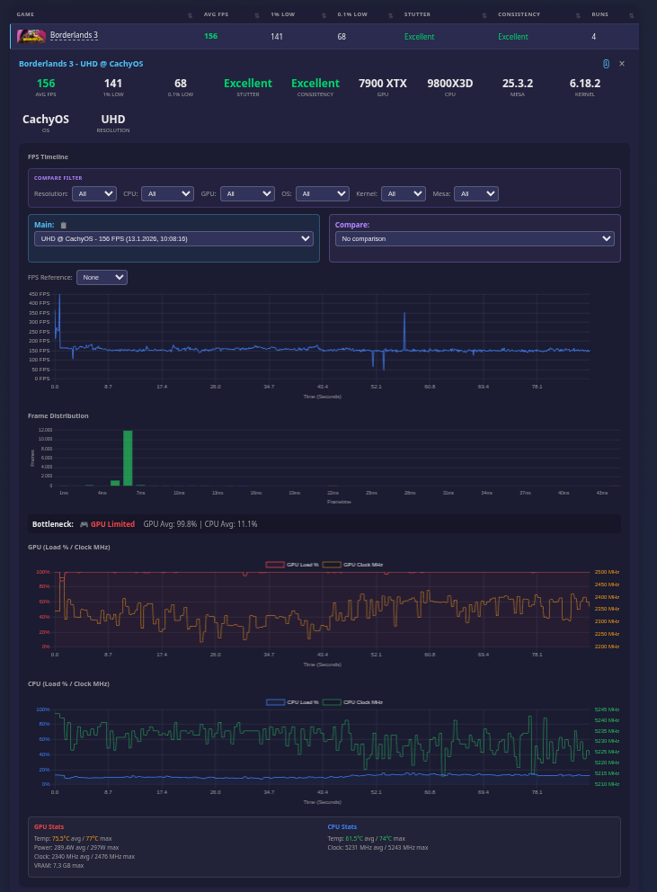

# Linux Game Benchmark (lgb)

Automated benchmark tool for Steam games on Linux.
Measures FPS, stutter, frame pacing and more using MangoHud.



## Features

- Automatic Steam game detection
- MangoHud integration for frametimes
- Detailed metrics (AVG FPS, 1% Low, 0.1% Low, Stutter)
- Multi-resolution support (HD, FHD, WQHD, UWQHD, UHD)
- **Multi-GPU support** (laptops with iGPU + dGPU)
- Beautiful HTML reports with interactive charts
- Multi-system comparison (compare different GPUs/CPUs)
- Upload to community database at [linuxgamebench.com](https://linuxgamebench.com)
- Automatic update notifications

## Requirements

- Linux (tested on Arch, Fedora, Ubuntu, openSUSE)
- Steam installed
- MangoHud installed
- Python 3.10+


## Installation

### Arch Linux / CachyOS (Recommended)

```bash
# Install MangoHud
sudo pacman -S mangohud lib32-mangohud

# Install pipx (manages Python CLI tools)
sudo pacman -S python-pipx

# Install the tool
pipx install git+https://github.com/taaderbe/linuxgamebench.git
```

### Ubuntu/Debian

```bash
sudo apt install mangohud pipx
pipx install git+https://github.com/taaderbe/linuxgamebench.git
```

### Fedora

```bash
# Install MangoHud
sudo dnf install mangohud

# Install pipx
sudo dnf install pipx

# Install the tool
pipx install git+https://github.com/taaderbe/linuxgamebench.git
```

### openSUSE Tumbleweed

```bash
# All packages available in main repo
sudo zypper install mangohud python313-pipx

# Install the tool
pipx install git+https://github.com/taaderbe/linuxgamebench.git
```

### Update to Latest Version

```bash
pipx uninstall linux-game-benchmark
pipx install git+https://github.com/taaderbe/linuxgamebench.git
```

### Install from Source (Development)

```bash
git clone https://github.com/taaderbe/linuxgamebench
cd linuxgamebench
python -m venv .venv
source .venv/bin/activate
pip install -e .
```

## Quick Start

### 1. Check System

```bash
lgb check
```

This will:
- Verify MangoHud, Steam and other tools are installed
- Automatically enable MangoHud globally (asks for confirmation)
- After enabling, log out and back in for changes to take effect

### 2. List Steam Games

```bash
# Scan and show all installed Steam games
lgb list-games

# Refresh game list (after installing new games)
lgb scan

# Filter: only Proton/Windows games
lgb list-games --proton

# Filter: only native Linux games
lgb list-games --native
```

Example output:
```
┏━━━━━━━━━━┳━━━━━━━━━━━━━━━━━━━━━━━━━━━━━┳━━━━━━━━━┓
┃ App ID   ┃ Name                        ┃ Type    ┃
┡━━━━━━━━━━╇━━━━━━━━━━━━━━━━━━━━━━━━━━━━━╇━━━━━━━━━┩
│ 1245620  │ Elden Ring                  │ Proton  │
│ 1174180  │ Red Dead Redemption 2       │ Proton  │
│ 427520   │ Factorio                    │ Native  │
└──────────┴─────────────────────────────┴─────────┘
```

### 3. Start a Game Benchmark

```bash
# By game name
lgb benchmark "Elden Ring"

# By Steam App ID
lgb benchmark 1245620

# With auto-stop after 60 seconds
lgb benchmark "Factorio" --duration 60
```

**How it works:**
1. lgb launches the game via Steam
2. Press **Shift+F2** in-game to start recording
3. Press **Shift+F2** again to stop (or wait for --duration)
4. Select resolution and optionally upload to community database
5. Repeat for more recordings or exit

### 4. View Report

```bash
xdg-open ~/benchmark_results/index.html
```

## Commands

| Command | Description |
|---------|-------------|
| `lgb check` | Check system requirements |
| `lgb list-games` | Show installed Steam games |
| `lgb scan` | Scan Steam library |
| `lgb info` | Show system information |
| `lgb benchmark [game]` | Launch game and benchmark |
| `lgb analyze [log]` | Analyze MangoHud log |
| `lgb report` | Regenerate HTML reports |
| `lgb settings` | Configure defaults (resolution, upload, etc.) |
| `lgb login` | Login to your account |
| `lgb logout` | Logout from your account |
| `lgb status` | Show login status and account info |

## Metrics

| Metric | Description |
|--------|-------------|
| **AVG FPS** | Average frames per second |
| **1% Low** | Lowest 1% of frametimes (shows micro stutters) |
| **0.1% Low** | Lowest 0.1% of frametimes (extreme stutters) |
| **Stutter** | How often do stutters occur? (excellent/good/moderate/poor) |
| **Consistency** | How consistent is the framerate? |

## Results Structure

```
~/benchmark_results/
    index.html                    # Overview of all games
    Baldurs_Gate_3/
        CachyOS_abc123/           # System 1
            FHD/
                run_001.json
            WQHD/
                run_001.json
        EndeavourOS_def456/       # System 2
            UHD/
                run_001.json
        report.html               # Game report with tabs
```

**Important:**
- Data is **NEVER deleted** - all benchmarks are preserved
- Each system gets its own folder
- Reports show all systems with tabs to switch between them

## MangoHud Setup

MangoHud is automatically configured when you run `lgb check`. Just log out and back in after.

**Manual setup (if needed):**
```bash
mkdir -p ~/.config/environment.d
echo "MANGOHUD=1" >> ~/.config/environment.d/mangohud.conf
# Then log out and back in
```

## Upload Results

Share your benchmarks at **[linuxgamebench.com](https://linuxgamebench.com)** and compare your hardware with the community!

Benchmarks are automatically uploaded after each `lgb benchmark` run. **No login required!**

```bash
lgb benchmark CS2  # Run benchmark - uploads automatically
```

**Optional:** Create an account for extra features (track your benchmarks, better compare, edit settings):
```bash
lgb login          # Login to your account
```

## Multi-GPU Systems

On laptops and desktops with multiple GPUs (e.g., Intel iGPU + NVIDIA dGPU), the tool automatically detects the correct GPU from the MangoHud log. The GPU that was actually used for rendering is recorded - no manual selection needed.

## License

GPL-3.0 License

## Contributing

Pull requests are welcome! Please create an issue first to discuss the change.
